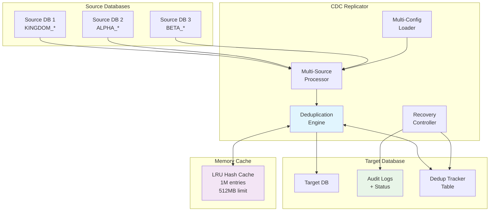

# Design Document

## Overview

The multi-source insert-only sync feature transforms the existing single-source CDC replicator into a horizontally scalable data consolidation system. The design employs a hub-and-spoke architecture where multiple source databases feed into a centralized target database using insert-only operations with intelligent deduplication.

Key design principles:
- **Insert-only operations**: Converts all UPDATE operations to INSERT operations to avoid conflicts
- **Content-based deduplication**: Uses SHA-256 hashing of normalized record content to detect duplicates
- **Memory-efficient tracking**: Combines in-memory LRU cache with persistent database storage for deduplication metadata
- **Crash-resistant recovery**: Ensures no data loss during system failures with status-tracked audit logs
- **Backward compatibility**: Maintains full compatibility with existing single-source deployments

## Architecture



## Components and Interfaces

### MultiSourceConfig
Manages configuration loading and validation for multiple database sources.

```python
class MultiSourceConfig:
    def load_sources(self) -> Dict[str, SourceConfig]
    def validate_connectivity(self) -> ValidationResult
    def get_insert_only_sources(self) -> List[str]
```

**Responsibilities:**
- Parse environment variables for multiple source prefixes
- Validate database connectivity for all sources
- Provide source-specific configuration objects
- Support configuration hot-reloading

### MultiSourceProcessor
Orchestrates parallel processing of multiple source audit logs.

```python
class MultiSourceProcessor:
    def process_all_sources(self) -> ProcessingResult
    def process_source_batch(self, source_id: str, batch_size: int) -> SourceResult
    def handle_source_failure(self, source_id: str, error: Exception) -> None
```

**Responsibilities:**
- Coordinate polling of multiple audit logs
- Maintain separate connection pools per source
- Handle source-specific errors without affecting others
- Aggregate processing statistics across sources

### DeduplicationEngine
Implements content-based deduplication with memory-efficient tracking.

```python
class DeduplicationEngine:
    def is_duplicate(self, table: str, record: Dict, source_id: str) -> bool
    def compute_content_hash(self, record: Dict, table: str) -> str
    def mark_processed(self, table: str, record_hash: str, source_id: str) -> None
    def cleanup_old_entries(self, retention_days: int) -> CleanupStats
```

**Hash Calculation Strategy:**
- Exclude metadata columns: created_at, updated_at, source_id, sync_timestamp
- Normalize string values: strip whitespace, convert to lowercase
- Sort dictionary keys for consistent ordering
- Use SHA-256 for cryptographic strength and collision resistance

### RecoveryController
Handles startup recovery and crash-resistant processing.

```python
class RecoveryController:
    def perform_startup_recovery(self) -> RecoveryResult
    def find_unprocessed_records(self, source_id: str) -> List[AuditRecord]
    def process_recovery_batch(self, records: List[AuditRecord]) -> None
```

**Recovery Process:**
1. Scan all audit logs for records with status = 'pending'
2. Sort by timestamp to maintain chronological order
3. Process through deduplication engine
4. Update status to 'processed' or 'duplicate'

### MemoryCache
High-performance LRU cache for recently processed record hashes.

```python
class MemoryCache:
    def get(self, key: str) -> Optional[str]
    def put(self, key: str, value: str, ttl_seconds: int) -> None
    def evict_expired(self) -> int
    def get_stats(self) -> CacheStats
```

**Memory Management:**
- Maximum 1 million entries (approximately 512MB)
- LRU eviction when capacity reached
- TTL-based expiration for automatic cleanup
- Statistics tracking for monitoring

## Data Models

### Enhanced Audit Log Schema
```sql
ALTER TABLE dbo.sync_audit_log ADD COLUMN
    status VARCHAR(20) DEFAULT 'pending' NOT NULL,
    source_id VARCHAR(50),
    content_hash VARCHAR(64),
    processed_at DATETIME2;

CREATE INDEX IX_sync_audit_log_status ON dbo.sync_audit_log (status, source_id);
CREATE INDEX IX_sync_audit_log_hash ON dbo.sync_audit_log (content_hash);
```

### Deduplication Tracker Table
```sql
CREATE TABLE dbo.dedup_tracker (
    id BIGINT IDENTITY(1,1) PRIMARY KEY,
    table_name VARCHAR(255) NOT NULL,
    record_hash VARCHAR(64) NOT NULL,
    source_id VARCHAR(50) NOT NULL,
    created_at DATETIME2 DEFAULT GETDATE(),
    last_seen_at DATETIME2 DEFAULT GETDATE(),

    CONSTRAINT UQ_dedup_tracker_hash UNIQUE (table_name, record_hash)
);

CREATE INDEX IX_dedup_tracker_table_hash ON dbo.dedup_tracker (table_name, record_hash);
CREATE INDEX IX_dedup_tracker_cleanup ON dbo.dedup_tracker (created_at);
```

### Configuration Data Model
```python
@dataclass
class SourceConfig:
    prefix: str
    host: str
    port: int
    database: str
    username: str
    password: str
    insert_only: bool
    batch_size: int = 500
    poll_interval: float = 1.0

@dataclass
class ProcessingStats:
    source_id: str
    records_processed: int
    duplicates_found: int
    errors_count: int
    processing_rate: float
    last_processed_time: datetime
```

## Correctness Properties

*A property is a characteristic or behavior that should hold true across all valid executions of a system—essentially, a formal statement about what the system should do. Properties serve as the bridge between human-readable specifications and machine-verifiable correctness guarantees.*

### Property 1: Multi-Source Connection Isolation

*For any* set of source database configurations, if one source connection fails, all other source connections shall remain operational and continue processing independently.

**Validates: Requirements 1.3**

### Property 2: Insert-Only Operation Conversion

*For any* audit log record with operation type 'U' (update), when insert-only mode is enabled, the system shall convert it to an INSERT operation while preserving all data content.

**Validates: Requirements 2.1**

### Property 3: Status Tracking Consistency

*For any* processed audit log record, the status column shall accurately reflect the processing outcome ('processed', 'duplicate', 'error') and be updated atomically with the actual processing action.

**Validates: Requirements 2.4**

### Property 4: Content Hash Determinism

*For any* database record, computing the content hash multiple times with identical input data shall produce identical hash values, regardless of the order of hash computation calls.

**Validates: Requirements 3.5**

### Property 5: Deduplication Effectiveness

*For any* pair of records with identical content but different source origins, the deduplication system shall identify them as duplicates and prevent the second insertion while logging the duplicate detection.

**Validates: Requirements 3.2, 3.3**

### Property 6: Recovery Completeness

*For any* set of unprocessed audit log records at startup, the recovery processor shall identify and process all records marked with status 'pending' before beginning live synchronization.

**Validates: Requirements 4.1, 4.2**

### Property 7: LRU Cache Eviction Correctness

*For any* sequence of cache operations that exceed the capacity limit, the memory cache shall evict entries in strict LRU order while maintaining all non-evicted entries in their correct positions.

**Validates: Requirements 5.2**

### Property 8: Cache-Database Fallback Consistency

*For any* hash lookup that misses in the memory cache, the result from the persistent deduplication tracker shall be identical to what would have been returned if the hash were present in cache.

**Validates: Requirements 5.4**

## Error Handling

### Connection Failures
- **Source Connection Lost**: Continue processing other sources, retry failed source every 30 seconds
- **Target Connection Lost**: Pause all processing, attempt reconnection every 10 seconds
- **Authentication Errors**: Log detailed error, mark source as failed, require manual intervention

### Data Processing Errors
- **Hash Computation Failure**: Log error with record details, mark as 'error' status, continue processing
- **Deduplication Engine Failure**: Fall back to allowing insertion with warning log
- **Memory Cache Overflow**: Gracefully evict entries, log cache statistics

### Recovery Scenarios
- **Partial Recovery Failure**: Process successful sources, retry failed sources independently
- **Schema Migration Errors**: Log detailed schema differences, attempt automatic column addition
- **Timeout Violations**: Log performance metrics, continue with reduced batch sizes

## Testing Strategy

The testing approach combines property-based testing for core logic validation with integration testing for external dependencies and infrastructure components.

### Property-Based Testing
- **Framework**: pytest with Hypothesis for Python
- **Test Configuration**: Minimum 100 iterations per property test
- **Coverage**: All 8 correctness properties from the design document
- **Data Generation**: Custom strategies for database records, configuration objects, and hash values
- **Property Test Tags**: Format: `Feature: multi-source-insert-only-sync, Property N: [property_title]`

### Unit Testing
- **Component Isolation**: Mock external dependencies (databases, network calls)
- **Edge Cases**: Empty batches, malformed records, configuration validation errors
- **Error Conditions**: Connection failures, memory exhaustion, timeout scenarios
- **Performance Validation**: Cache efficiency, hash computation speed, memory usage

### Integration Testing
- **Database Integration**: Real database connections for schema operations
- **Multi-Source Scenarios**: Parallel processing validation with test databases
- **Recovery Testing**: Crash simulation and restart verification
- **Configuration Testing**: Environment variable parsing and validation

### Performance Testing
- **Load Testing**: 100,000+ records across 5+ sources simultaneously
- **Memory Testing**: Validate 1M cache entries stay under 512MB limit
- **Recovery Performance**: 30-second recovery time validation with large datasets
- **Cleanup Performance**: Retention period cleanup efficiency testing

<function_calls>
<invoke name="invoke_sub_agent">
<parameter name="name">subagent_requirement-detailer